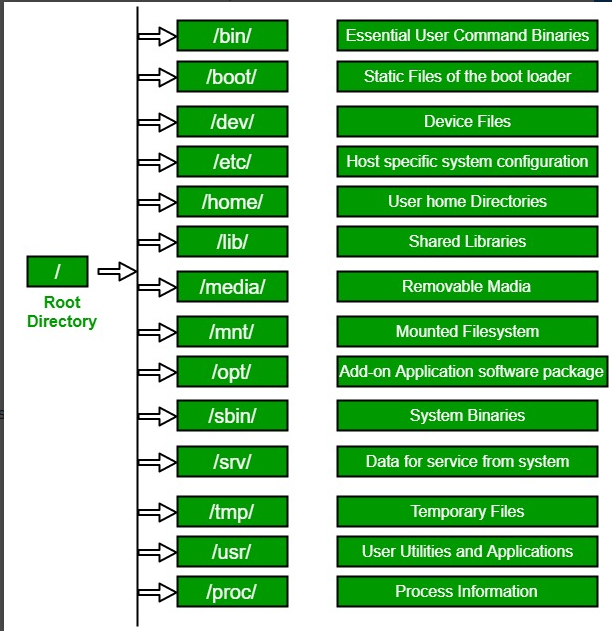
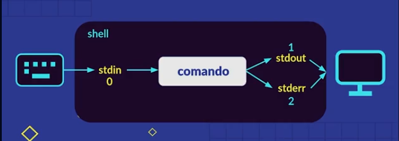
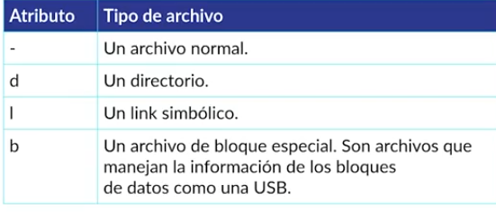
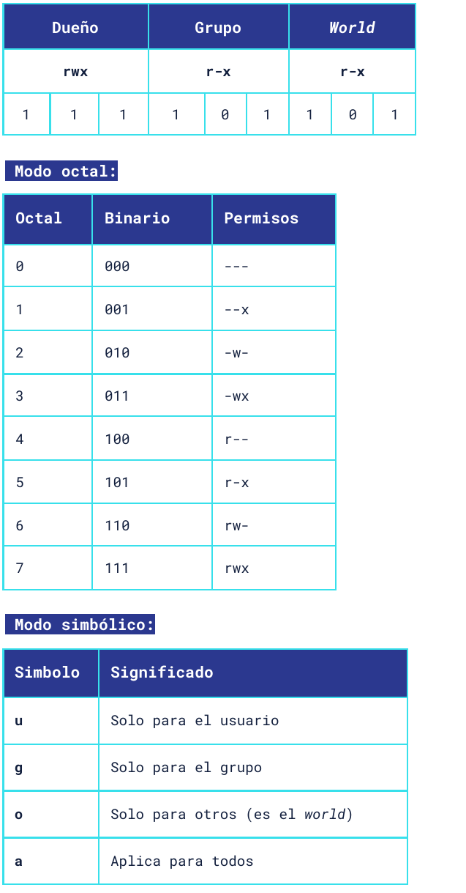
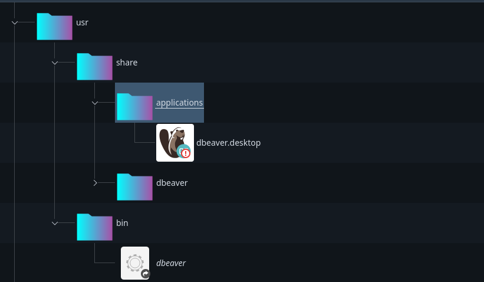

- [La terminal de Linux](#la-terminal-de-linux)
  - [Sistema de archivos linux](#sistema-de-archivos-linux)
  - [Manipulando archivo y directorios](#manipulando-archivo-y-directorios)
  - [Explorando el contenido de archivos](#explorando-el-contenido-de-archivos)
  - [Que es un comando](#que-es-un-comando)
  - [WildCards](#wildcards)
  - [Redirecciones](#redirecciones)
    - [stdin stdout stderr](#stdin-stdout-stderr)
    - [Pipe operator](#pipe-operator)
    - [Encadenando comandos : opeardores de control](#encadenando-comandos--opeardores-de-control)
- [Permisos](#permisos)
  - [Modificar los permisos](#modificar-los-permisos)
- [Variables de entorno](#variables-de-entorno)
- [Comandos de búsqueda](#comandos-de-búsqueda)
- [Comando grep](#comando-grep)
- [Utilidades de red](#utilidades-de-red)
- [comprimiendo archivos](#comprimiendo-archivos)
  - [TAR](#tar)
  - [ZIP](#zip)
- [Manejo de procesos](#manejo-de-procesos)
  - [procesos en background y foreground](#procesos-en-background-y-foreground)
- [Editores de texto en la terminal](#editores-de-texto-en-la-terminal)
- [Ejecutar scripts con supervisor](#ejecutar-scripts-con-supervisor)
- [Instalar programas Linux cuando nos bajamos un rpm](#instalar-programas-linux-cuando-nos-bajamos-un-rpm)
- [INSTALAR MariaDB](#instalar-mariadb)
- [Customizando la terminal](#customizando-la-terminal)

# La terminal de Linux

La terminal es interfaz gráfica que alberga la línea de comandos o shell. El shell es un programa que toma comandos y os pasa al SO para realizar una función.

Hay varios tipos de shhell:

1. Bourne Shell
2. Bash shell
3. Z shell
4. C shell
5. Korn shell
6. Fish Shell
7. PowerShell

Un comando es un programa que se puede ejecutar desde la terminal y éste puede recibir algunos parámetros y opciones

## Sistema de archivos linux



Comandos:

1. file => nos da info sobre un archivo

```
file archivo.txt
```

2. ls => listar directorios/archivos

acepta parámetros como:

-lh, long-human descripción completa de los directorios/archivos y cuanto ocupan
-la muestra archivos ocultos
-lS ordena los directorios por tamaño

3. tree => muestra todos los archivos en todos los niveles

tree -L 2 => muestra archivos hasta 2 niveles de profundida

## Manipulando archivo y directorios

- mkdir => crear directorio
  mkdir dir1 dir2 dir3 (crea 3 directorios de una vez)

* touch => crear un archivo

* cp => copiar un archivo
  - cp file1 newFile1
* mv => mueve archivos, también sirve para renombrar archivos/directorios
  - mv newFile1 .. (mueve el file al directorio anterior)
* rm => eliminar un archivo
  - rm newFile1
  - rm -i file1 (antes de borrar nos lo pregunta y | n)
  - rm -r dir1 (-recursiva es para borrar directorios con contenido)
  - rm -rf dir1 (-recursivo -force)

## Explorando el contenido de archivos

1. head => nos devuelve las primeras 10 líneas del archivo
   1. -n 20 (ahora nos devuelve las primeras 20)
2. tail => muestra las últims 10 líneas del archivo
   1. -n 20
3. less => nos muestra todo el contenido del archivo, es interactivo así que puedo hacer ciertas acciones escribiendo comando en el prompt:
   1. /palabraABuscar
4. xdg-open => permite abrir un archivo lanzando el programa x defecto para cada tipo de archivo
5. dolphin / nautilus permite abrir el explorador de archivos

## Que es un comando

Un comando puede ser:

1. Un programa ejecutable, se guardan normalmente en l /usr/bin
2. Un comando de utilidad de la shell, una función que viene por defecto para la shell
3. Una función de shell, realizada por nosotros
4. un alias

con el comando type nos dice cual de los 4 tipos anteriores es un comando

```
type cd # cd is a shell builtin
type mkdir # is a /usr/bin/mkdir
type ls # is a aliased  to 'ls --color=auto'
```

Para crear un alias hacemos:

```
alias l="ls -lh"
```

Los alias solo duran durante la sesión de la terminal, son temporales.

el comando **help** nos abre una ayuda para el comando especificado, solo funciona para una shell bash

```
help cd
```

El comando **man**/**info** nos permite abrir el manual de usuario de cierto comando

```
man ls
info ls
whatis ls
```

## WildCards

Son una serie de carcateres especiales que nos permiten usar patrones para realizar búsquedas avanzadas. Por ejemplo hacemos un ls solo de los archivos que terminan en .html o .txt y así. Las wildcards buscan hasta dos niveles dentro de las carpetas, para limitar la búsqueda al directorio actual, no en sus contenidos, debemos añadir el flag `-d`

```
ls *.txt
ls datos*  # cualquier caracter al final
ls datos?  # solo un caracter al final
ls -d [[:upper:]]* cualquier directorio en mi ubicación actual que empieze por mayúscula
ls -d [[:lower:]]* cualquier directorio en mi ubicación actual que empieze por mayúscula
```

clases con wildcards, podemos usar `[[:clase:]]`para crear patrones

```
ls [ad]*            # cualquier archivo o directorio que empiece por a | d
ls *[[:digit:]]*    # lista los directorio que contienen dígitos en el nombre

```

## Redirecciones

### stdin stdout stderr

La shell funciona con unos comandos de entrada `inputs` que generan unas salidas `outputs`.



- stdin => standrd input === 0 (FD, file Descriptor)

- stdout => standrd output 1=== 1 (FD, file Descriptor)

- stderr => standrd error 2=== 2 (FD, file Descriptor)

por ejemplo como stdin puedo listar los archvos del directorio mis Imagenes, eso genera una salida stdout (los nombres de los archivos) puedo redirigir y que se guarden en un archivo para la redirección se usa el símbolo `>`.

```
ls Imágenes/ > archivo.txt
```

si usamos `>` siempre crea un nuevo archivo si quisieramos concatenar debemos usar `>>` es decir irá agregando al archivo los nuevos datos.

```
ls Descargas/ >> archivo.txt
```

Si el comando nos arroja un error, un staderr el archivo quedará vacío pq `>`solo redirige el stdout para que redirija el stderr debemos agregarle el FD

```
ls dirInventado/ 2> archivo.txt
```

Podemos redirigir ambos, redirige todo lo que hay en el directorio `dirInventado` a un archivo `output.txt` tanto el stderr y el stdout

```
ls dirInventado/ > output.txt 2>&1
```

### Pipe operator

permite ejecutar un comando que su stdout pase como stdin a otro comando, generando diferentes filtros.

`echo` nos genera un output en pantalla, imprime en la temrinal cualquier texto
`cat` permite concatenar el output de dos archivos, o tb lee archivos y salidas de comandos, mostrando su contenido en la terminal (sin abrir editores de texto)
`tee` permite crear un archivo utilizando el ouput generado por un pipe, el comando > no funciona con pipes

```
cat newFile.txt newFile2.txt
```

sacamos el listado de directorio se lo pasamos a tee para q genere el archivo y ese archivo se lee con cat

```
ls -lh | tee output.txt | cat
```

podemos pasarle filtros a pipe

```
ls -lh Descargas | sort | tee output.txt | cat
```

### Encadenando comandos : opeardores de control

- Síncronos `;`
  Correr comandos de manera síncrona, uno después de otro, usamos el operador `;`

```
ls; mkdir newDir; cal
```

- Asíncronos `&`

Podemos hacer comandos asíncronos, cada comando usará un hilo del procesador usando el operador `&`

```
ls & date & cal
```

- ejecución condicionada de comandos, operador si.. `&&`

```
mkdir test && cd test
```

tabién tenemos un operador or `|| `

```
cd dirNoExiste || echo "hello!"
```

# Permisos


el primer caracter es el tipo de archivo:



Luego hay tres grupos cada uno de estos grupos está formado por 3 letras r(read)w(write)x(execute) cada una de estas acciones puede tener un valor 1 (True) 0 (false), esto son los permisos



## Modificar los permisos

Para modificar permisos usamos el comando `chmod`

```
chmod 755 miTexto.txt
```

7 => rwx
5=> r-x

podemos usar el módo simbólico

```
chmod g+x myFile.txt # añadimos permiso de ejeución al grupo
chmod g-wx myFile.txt # quitamos permiso de escritura y ejecución  al grupo
chmod u-x,go+wx myFile.txt # quitamos permiso de ejecución al user y añadimos al grupo y others de w and x
chmod u=x myFile.txt # ponemos solo permisos de ejecución al user con el operador =
```

para mostrar nuestro usuario actual usamos `whoiam`

```
whoami # david
id    # uid=1000(david) gid=1001(david) grupos=1001(david),4(adm),24(cdrom),27(sudo),30(dip),46(plugdev),120(lpadmin),132(mongodb),1000(sambashare)
```

Podmos cambiar de usuario `su`switch user

En nuestro usuario podemos cambiar la contraseña con `passwd`

```
passwd
```

# Variables de entorno

Recordemos un tipo de archivo que son los links simbólicos, simplemente hacen referencia a una ruta.

```
ln -s Programacion/CURSO-GIT-GITHUB GitCourse
```

es cooomo crear un acceso directo


Para imprimir las variables de entorno

```
printenv
```

para imprimir el valor de una variable de entorno usamos echo

```
echo $JAVA_HOME
```

Una variable importante es $PATH contiene toda la ruta a los binarios que ejecuta nuestro sistema. Esto es importante pq cuando usamos un gestores de paquetes como `apt` se encargan de traer un binario e instalarlo en nuestro pc.

Las cofiguraciones de nuestro bash se guardan en el archivo `.bashrc` de nuestro directorio `/home/david`. Este archivoo se carga al arrancar la terminal, podemos incluir un nuevo binario a la variable PATH desde este archivo

```bash

PATH=$PATH:/home/david/paquete/bin
```

una vez hecho esto debemos volver a ejecutar la terminal

```
bash
```

y así cargamos la nueva configuración.

# Comandos de búsqueda

el comando `which` nos permite encontrar la ruta de nuestro binarios

```
which code # /usr/bin/code
```

tb podemos usar `whereis`

```
whereis code # code: /usr/bin/code /usr/share/code
```

el comando `find` nos busca a partir de una ruta dada en todos los niveles el nombre de un archivo

```
find ./Programacion -name '*.txt' | less
```

podemos filtrar por tipo

```
find ./ -type f,d -name 'output*'
```

f -> file
d -> directory

```
find ./ -type f -name '*.log'
```

podemos filtrar por tamaño

```
find ./ -size 20M
```

# Comando grep

Nos permite encontrar coincidencias de una búsqueda dentro de un archivo o un output de un comando que encajen con una expresión regular

```
grep Towers movies.csv
# 108583,Fawlty Towers (1975,Comedy,-1980,1,54 5952,"Lord of the Rings: The Two Towers, The",Adventure|Fantasy,2002,4,81
```

podemos usar -i para q ignore el casesensitive

```
grep -i Towers movies.csv
```

si queremos saber las veces que aparece la ocurrencia filtrada

```
grep -c the movies.csv
grep -ci the movies.csv # sin case sensitive
```

Para negar la expressión regular

```
grep -vi towers movies.csv
```

buscar algo de n output

```
ls | grep movies
```

# Utilidades de red

Para sacar la info de nuestra red

```
ifconfig
```

Para saber si tenemos acceso a internet o para saber si una web está activa podemos usar `ping`

```
ping www.google.com
```

Podemos traer el html de la pagina deseada con `curl`, al trearnos esta info podemos guardarla en un archivo de texto

```
curl www.google.com > index.html
```

con `wget` tb nos podemos traer el html de una página pero descarga el archivo directamente y lo guarda como index.html

```
wget www.google.com
```

`traceroute` nos da todas las computadoras por las que pasa mi petición hasta llegar a la página solicitada, se debe instalar (sudo apt install traceroute)

```
traceroute www.google.com
```

`netstat -i` nos da info de nuestras interfaces de red de manera resumida (apt install net-tools)

```
netstat -ai  # estadisticas de las interfaces de conexión
netstat -nr  # network routing table
netstat -ant # muestra conexiones de red
netstat -pnltu # conocer los servicios de red activos
```

# comprimiendo archivos

creamos directorio cn archivos

```
$ mkdir toCompress
$ cd toCompress/
$ touch file1 file2 file3
$ cd ..
$ tree toCompress/

toCompress/
├── file1
├── file2
└── file3

0 directories, 3 files
```

## TAR

para comprimir nuestro directorio utilizando el formato de cmpresión tar
c->create,crea un archivo comprimido
v->verbose, nos muestre en terminal los pasos que sigue
f->file, utiliza el nombre facilitado para crear el archivo

```
tar -cvf comprimida.tar toCompress
```

podemos añadir una z para que use un algoritmo de compresión más potente gzip

```
tar -cvzf comprimida.tar.gz toCompress
```

Para descomprimir un gzip

```
tar -xvzf comprimida.tar.gz
tar -xvf comprimida.tar
```

## ZIP

no comprime tanto como con tar.gz

```
zip -r toCompressToZIP.zip toCompress
```

para descomprimir

```
unzip toCompressToZIP.zip
```

# Manejo de procesos

Para mostrar los procesos que están corriendo

```
ps
```

esto nos da una tabla con el PID (process identifier)

```
    PID TTY          TIME CMD
   4386 pts/1    00:00:00 bash
   7605 pts/1    00:00:00 ps
```

para matar un proceso podemos usar `kill` y el PID

```
kill 7605
```

para mostrar los procesos que estan consumiendo más cpu usamos `top`, esto abre una interfaz en la teminal en tiempo real de los procesos q están corriendo, podemos hacer varias occiones por ejemplo si le damos a u nos permite filtrar por usuario (para salir de top, simplemento teclear q)

```
top
```

## procesos en background y foreground

Cuando un proceso está en ejecución sin que sea mostrado en la terminal se dice que se está ejecutando en el background. Si se muestra la ejecución del comando dentro de la terminal se dice que está en el foreground. En esta clase aprenderás a cómo mover los procesos del background al foreground a tu voluntad, incluso a cómo suspenderlos.

`cat > mi_nota.txt`

Nuestra terminal se verá con el prompt esperando a que ingresemos texto.

Podemos escribir algo y después terminar el input del texto con CTRL+D, pero en esta ocasión no haremos eso. Lo que queremos hacer será suspender el proceso, esto lo podemos hacer con CTRL+Z. El resultado que nos mostrará la terminal deberá ser uno donde nos indique la suspensión del comando cat.

Ahora hemos movido nuestro comando exitosamente al background de la terminal. Para consultar todos los procesos que tenemos en background podemos hacerlo con el comando jobs.

A la izquierda aparece el número del trabajo ( ⚠ ️ cuidado que no es lo mismo que el process ID). Si queremos traer la ejecución de nuevo a la terminal, es decir, al foreground; debemos usar el comando fg y especificar qué número de trabajo queremos continuar. Para nuestro caso será el 1.

`fg 1`

En caso de que estés usando ZSH como shell el formato para llamar el trabajo sería con un porcentaje. ZSH tiende a interpretar algunas cosas incluyendo las wildcards de manera diferente.

`fg %1`

Una vez enviado al foreground veremos como se activa la ejecución del comando en la terminal y podremos seguir escribiendo nuestra nota. Recuerda que una vez terminemos de escribir presionamos CTRL+D para terminar el input y guardar.

Cuando se guarda nuestra nota nos daremos cuenta de que el proceso por fin termina y si usamos jobs no nos mostrará ningún trabajo en background.
Otras formas de enviar al background

Existen otras formas de enviar comandos al background. La primera es usando el operador de control & al final de un comando. Este operador nos permite enviar de manera directa un proceso al background una vez ejecutado. Por ejemplo:

`cat > mi_nota.txt &`

La segunda forma es con el comando bg. Este sirve de manera similar que fg solo que en vez de traerlo al foreground este lleva un trabajo al background. Por ejemplo:

`bg 1`

Bien, la pregunta ahora es ¿Cómo usamos bg? Imagina que abrimos algún programa de interfaz gráfica desde la terminal. En mi caso abriré el navegador Google Chrome. Para hacerlo desde la terminal solo ejecuta:

`google-chrome-stable`

Y verás como se ejecuta pero no nos deja hacer ninguna otra tarea ya que la ventana del navegador está abierta:

Para suspender el proceso como ya sabes lo hacemos con CTRL+Z y si revisamos con jobs veremos como el proceso se encuentra en pausa. En este caso la ventana del navegador que se abrió no nos dejará interactuar ni escribir en ella.

Como se ve en la imagen el navegador tiene el número de trabajo 1. Para dejar nuestro navegador corriendo y al mismo tiempo seguir trabajando en la terminal tenemos que reactivar este proceso y a la vez mandarlo al background. Para ello ejecutamos:

`bg 1`

Con esto podremos ver como nuestro proceso de Google Chrome sigue corriendo en el background dejando la terminal disponible para nosotros.

# Editores de texto en la terminal

Uno de los más comunes en VIM

```
vim # entra en el editor
```

para salir solo hay q presionar `:q`

# Ejecutar scripts con supervisor

Supervisor es una herramienta linux que nos permite gestionar los diferentes procesos de nuestro sistema. Por ejemplo nos permite mantener un prorama en constante ejecución.
Es perfecto cuando desplegamos una WebApp.

Creamos un script, lo haremos en python main.py

```python
import time
import datetime

while True:
  now = datetime.datetime.now()
  print(now.strftime(%b %d %Y %H:%M:%S))
  time.sleep(10)

```

Instalamos supervisor como paquete del sistema

```
sudo apt install supervisor
```

supervisor es un servicio en el sistema así que para gestionar ese servicio usaremos la suit systemd.

Configuramos para que el sistema arranque supervisor con cada reinicio del SO

```
sudo systemctl enable supervisor
sudo systemctl restart supervisor
```

Creamos el servicio en supervisor

```
sudo nano /etc/supervisor/conf.d/nombreDelServicio.conf
```

Dentro escribimos:

```
[program:nombreDelServicio]
command=python3 /home/user/main.py
autostart=true
autorestart=true
stderr_logfile=/home/user/nombreDelServicio.error.log
stdout_logfile=/home/user/nombreDelServicio.out.log
environment=PYTHONUNBUFFERED=1 # python no imprime nada si no tiene un salto de línea con esta línea eliminamos esa restricción
```

Una vez hecho esto tenemos que notificar a supervisor que existen cambios en la ruta conf.d para ello `sudo supervisorctl reread` y agregamos nuestro servicio/proceso a la lista de supervisor hacemos `sudo supervisorctl update`
Para ver el estado de los servicios que gestiona supervisor hacemos `spervisorctl status`

Si modificara el archivo de conf de mi servicio debo repetir los pasos de reread y update.

Para finalizar los procesos `sudo supervisorctl stop nombreDelServicio`

# Instalar programas Linux cuando nos bajamos un rpm

Puede que nos bajems el rpm

```
sudo rpm -ivh dbeaver-<version>.rpm

```

si lo queramos instalar manuealmente.

Cuando los descomprimamos tendremos:



Este árbol de directorios simula el que tenemos en local `/usr/...` así que lo único que debemos hacer es copiar cada una de esas carpetas donde corresponda en local.

# INSTALAR MariaDB

source : https://downloads.mariadb.org/mariadb/repositories/#distro=Ubuntu&distro_release=focal--ubuntu_focal&mirror=netcologne&version=10.6

Here are the commands to run to install MariaDB 10.6 from the MariaDB repository on your Ubuntu system:

```
sudo apt-get install software-properties-common
sudo apt-key adv --fetch-keys 'https://mariadb.org/mariadb_release_signing_key.asc'
sudo add-apt-repository 'deb [arch=amd64,arm64,ppc64el] https://mirror.netcologne.de/mariadb/repo/10.6/ubuntu focal main'

```

Once the key is imported and the repository added you can install MariaDB 10.6 from the MariaDB repository with:

1. sudo apt update
2. sudo apt install mariadb-server

# Customizando la terminal

Para refrescar el archvo de configuración de zsh

```
source ~/.zshrc
```

para customizar el tema de mi zsh, poerlevel10k, abrimos en vscode su archivo de configuración `~/.p10k.zsh`
